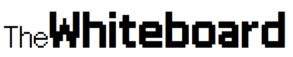
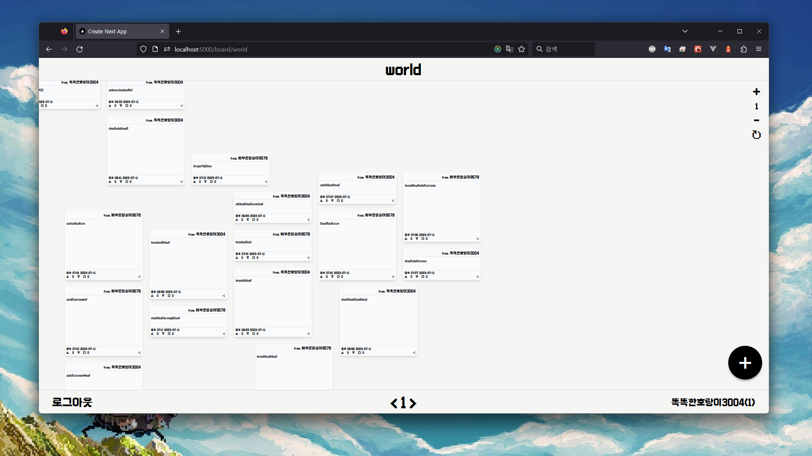
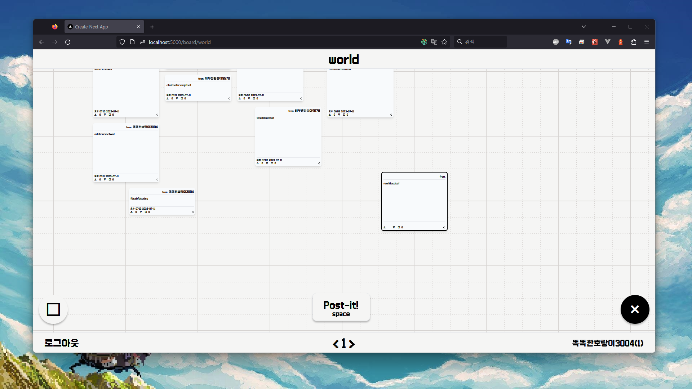

<h1 align="center"></h1>
<h3 align="center">⚠️개발 중⚠️</h3>
<h4 align="center"><a href="https://whiteboard-puce.vercel.app/" target="_blank">DEMO. 🔗</a></h4>

 

  

  

---

<h3 align="center">stacks</h3>

- Next.js 13 (`app/` directory)
- Prisma & PostgreSQL
- Tailwind CSS
- Apollo GraphQL
- Google OAuth